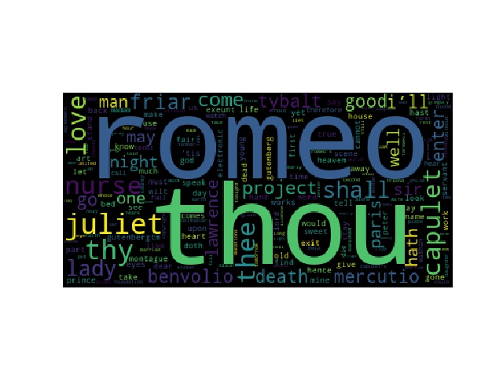

# WordCloud
A project that generates a 'word cloud' from some text.

## Project files
The project includes three files:
1. `generate_wordcloud.py` is the main script.
2. `romeo_and_juliet.txt` is the input text sample.
3. `romeo_and_juliet_wordcloud.jpeg` is the output image sample.
4. `README.md` is where you provide information about other files.

## How to run
- Required command-line flag:
   * `file_path` is the path to the input text file
- Give executable permission to the script `generate_wordcloud.py`:
   * `chmod +x generate_wordcloud.py`
- A sample command:
   * `./generate_wordcloud.py --file_path ./romeo_and_juliet.txt`
   * the 'word cloud' image:
   
